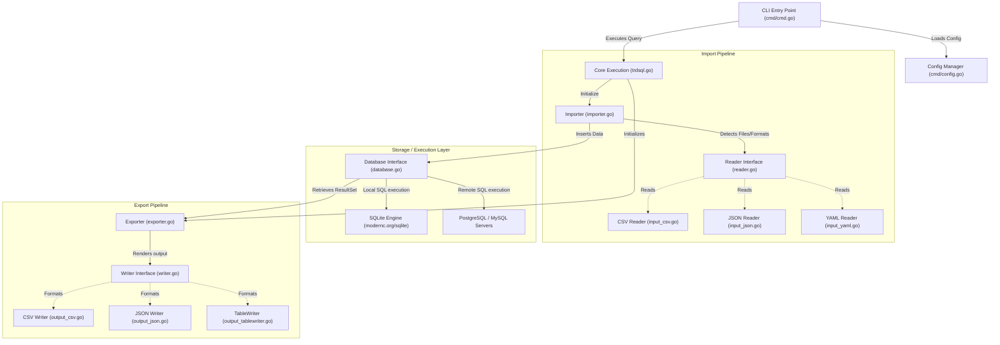
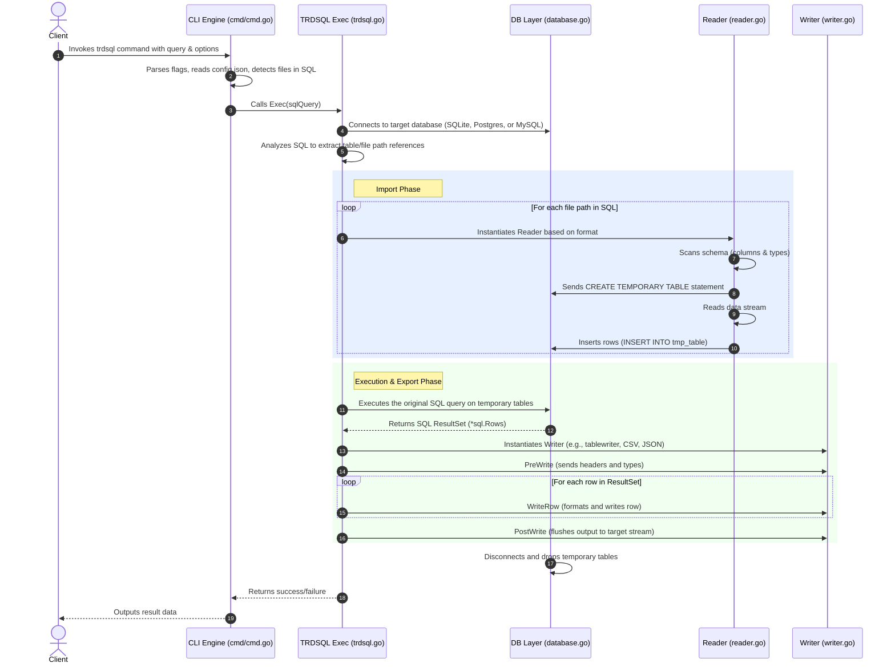
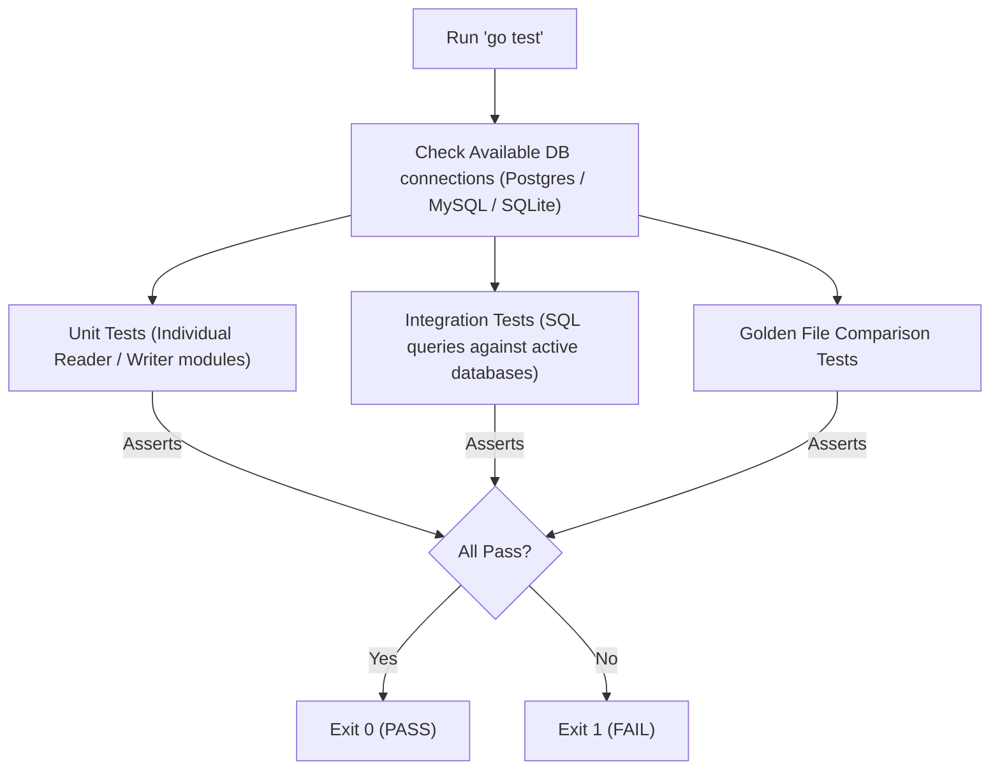

# Architectural Design and Technical Specification - trdsql

<!-- Inline Comment: This document serves as the formal technical architecture design specification for trdsql, written for senior systems architects. -->

## 1. Application Overview and Objectives

`trdsql` is a high-performance command-line interface (CLI) tool and Go library designed to treat structured text files (such as CSV, LTSV, JSON, YAML, and TBLN) as relational database tables. By dynamically parsing and importing these files into a virtualized relational database, `trdsql` permits the execution of complex SQL queries (including joins, aggregates, subqueries, and window functions) using standard SQL dialects (SQLite, PostgreSQL, or MySQL).

### Objectives
* **Abstraction of File Parsers:** Provide a unified interface to read disparate tabular and hierarchical data formats.
* **SQL Engine Decoupling:** Leverage existing, battle-tested SQL database engines (embedded or remote) rather than reimplementing a query parser.
* **Streaming and Memory Efficiency:** Support execution on large data sets by streaming parsing and database insertion operations, minimizing the resident memory footprint.
* **Dialect Richness:** Retain the full feature set of PostgreSQL, MySQL, or SQLite syntax depending on the selected driver.

---

## 2. Architecture and Design Choices

### Core Architecture Component Diagram

The system follows a modular pipeline design, isolating CLI flag evaluation, input format parsing, database management, and output serialization:



### Design Decisions and Assumptions
* **Database Virtualization:** Rather than evaluating SQL queries directly in-memory, `trdsql` assumes an underlying database transaction. By default, it spawns an embedded, serverless in-memory SQLite database ([modernc.org/sqlite](https://pkg.go.dev/modernc.org/sqlite) in pure Go, or CGO-based `github.com/mattn/go-sqlite3`).
* **Table Virtualization:** Any table name referenced in the SQL statement (e.g. `SELECT * FROM test.csv`) is assumed to be a file path. The [Importer](importer.go) intercepts the query, parses the referenced file paths, creates corresponding temporary tables in the database, and inserts the file records before query execution.
* **Schema Inference:** Column names are either parsed from the file headers (if enabled) or generated as ordinal columns (`c1`, `c2`, etc.). Datatypes are dynamically evaluated during pre-reading.

### Edge Cases and Handling
* **Missing Header Names:** Handled by fallback to index-based names (`c1`, `c2`).
* **Irregular Row Lengths:** If a row contains more fields than inferred during pre-reading, excess columns are ignored or padded with `NULL` depending on reader specifications.
* **Large Files:** Instead of loading the entire file into memory, `trdsql` uses Go's [io.Reader](https://pkg.go.dev/io#Reader) to stream records in batches, keeping memory consumption bound to the batch size and the database transaction limit.

---

## 3. Data Flow and Control Logic

### Operational Flow

The life cycle of an execution is managed by the `TRDSQL` structural runner inside [trdsql.go](trdsql.go).



### Module Relations and Code Architecture
* **[trdsql.go](trdsql.go):** Coordinates the execution. The central struct `TRDSQL` maintains state for `Importer`, `Exporter`, `Driver`, and `Dsn`.
* **[database.go](database.go):** Abstracts sql transaction management, table creation (`CreateTableContext`), and high-performance copying methods (such as PostgreSQL's `COPY` command via `copyImport`).
* **[reader.go](reader.go):** Defines the `Reader` interface. Specific implementations register their `ReaderFunc` dynamically.
* **[writer.go](writer.go):** Defines the `Writer` interface to format output streams.

---

## 4. Dependencies

The application relies on Go standard library packages and selected external modules:

### Core Database Drivers
* **[modernc.org/sqlite](https://pkg.go.dev/modernc.org/sqlite):** Provides a pure Go SQLite implementation, removing CGO build requirements on environments like Windows.
* **[github.com/lib/pq](https://pkg.go.dev/github.com/lib/pq):** Pure Go driver for PostgreSQL, used for remote/local PostgreSQL database execution.
* **[github.com/go-sql-driver/mysql](https://pkg.go.dev/github.com/go-sql-driver/mysql):** Pure Go driver for MySQL.

### Parsing and Utility Libraries
* **[github.com/olekukonko/tablewriter](https://pkg.go.dev/github.com/olekukonko/tablewriter):** Renders output as markdown or ASCII tables. (Version `v1.1.4` is explicitly used for option-based initialization and auto-alignment).
* **[github.com/goccy/go-yaml](https://pkg.go.dev/github.com/goccy/go-yaml):** Used for parsing and generating YAML structures.
* **[github.com/itchyny/gojq](https://pkg.go.dev/github.com/itchyny/gojq):** Implements JSON Query syntax to filter JSON input streams prior to database loading.
* **[github.com/dsnet/compress](https://pkg.go.dev/github.com/dsnet/compress):** High-performance decompression utility for archive formats.

---

## 5. Security Assessment

### Log Injection Protection
To prevent log spoofing or injection vulnerabilities (flagged by `gosec`), all file system operations and error messages are sanitized to strip out control characters (specifically carriage returns and line feeds) before logging to stdout or stderr.

### Directory Traversal Prevention
Path strings supplied as CLI arguments or read from config files are forced through the [filepath.Clean](https://pkg.go.dev/path/filepath#Clean) helper. This mitigates risks associated with relative path injection (e.g. `../../etc/passwd`).

### Environment Security & Privilege Model
* **Unprivileged Context:** `trdsql` is designed to run in user-space under unprivileged contexts. It requires no elevated OS rights, root system directories, or administrative privileges.
* **Network Isolation:** By default, when executing local SQLite transactions, the tool operates entirely offline with zero open sockets or external communication.
* **Secret Management:** Database passwords passed via command line flags or files should be handled through environment variables or locally restricted config files ([cmd/config.go](cmd/config.go)).

---

## 6. Code Quality Assessment and Best Practices

### Code Quality Measures
* **Static Analysis:** The repository integrates `golangci-lint` containing standard Go linters (`gofumpt`, `gosec`, `govet`, `errcheck`, `gocyclo`).
* **Error Handling:** Unhandled errors on helper operations (like string formatting or terminal flushes) are explicitly documented using blank identifiers (`_, _ = fmt.Fprint(...)`) to assert developer intent and eliminate compiler warnings.
* **Explicit Resource Cleanup:** File descriptors, rows, database connection sessions, and transaction buffers are consistently handled via `defer` blocks to prevent resource leaks during large batches.

---

## 7. Command Line Arguments

Below is the technical breakdown of the command line interface parameters:

| Flag | Argument Type | Default Value | Description |
| :--- | :--- | :--- | :--- |
| `-db` | string | `""` | Database name configured in the configuration file. |
| `-driver` | string | `"sqlite3"` | Database driver name (`sqlite` / `mysql` / `postgres`). |
| `-dsn` | string | `""` | Database connection Data Source Name. |
| `-q` | string | `""` | Path to a file containing the SQL query to execute. |
| `-id` | string | `","` | Input delimiter symbol (mainly for CSV and TSV). |
| `-is` | int | `0` | Number of header lines to skip. |
| `-ih` | bool | `false` | Specifies if the input file contains a header row. |
| `-inull` | string | `""` | String value to replace with `NULL` in the database. |
| `-out` | string | `""` | Path to the file where output should be written. |
| `-o` | string | `"csv"` | Output format type (`csv`, `json`, `ltsv`, `yaml`, `tbln`, `vertical`, `raw`, `at`, `md`). |
| `-ig` | bool | `false` | Guess the format from the file extension. |

---

## 8. Deployment and Usage Examples

### Standard CSV Query with Console Table Output
Reads from a local comma-separated values file and outputs a clean markdown-compliant table.

#### Command:
```bash
trdsql -ih -o md "SELECT name, age, city FROM testdata/users.csv WHERE age > 30"
```

#### Output:
```markdown
|  name   | age |   city    |
|---------|-----|-----------|
| John    |  34 | Chicago   |
| Sarah   |  42 | Seattle   |
```

### Joining JSON and CSV Databases
Performs a relational `INNER JOIN` between a JSON data structure and a CSV file using SQLite in-memory tables.

#### Command:
```bash
trdsql -ih "SELECT u.name, d.department FROM testdata/users.csv u JOIN testdata/dept.json d ON u.id = d.user_id"
```

#### Output:
```text
John,Engineering
Sarah,Product
```

---

## 9. Test Suite

The test suite is structured around Go's native testing framework and covers unit-level code coverage and end-to-end integration tests.

### Test Logic Flow



### Component Test Breakdown
* **Execution Tests ([trdsql_test.go](trdsql_test.go)):** Validates correct parsing of file patterns (e.g. wildcards like `tt*.csv`) and generic database actions.
* **Golden Tests:** Compares terminal table formatting and output configurations against pre-recorded reference outputs in the [testdata](testdata/) directory (`at.golden`, `md.golden`).
* **Module-Specific Unit Tests:** Verify format limits (such as reading invalid nested structures in LTSV or parsing JSON streams containing empty arrays).

### Execution Procedures
To run the test suite in a CGO-disabled context:
```bash
CGO_ENABLED=0 go test -v ./...
```
To run the tests with CGO enabled (using the MinGW compiler in Windows):
```powershell
$env:Path = "d:\dev\mingw64\bin;" + $env:Path
go test -v ./...
```
